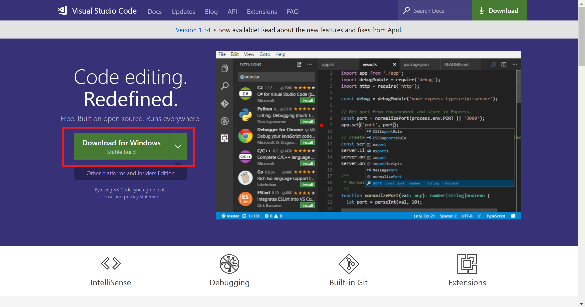
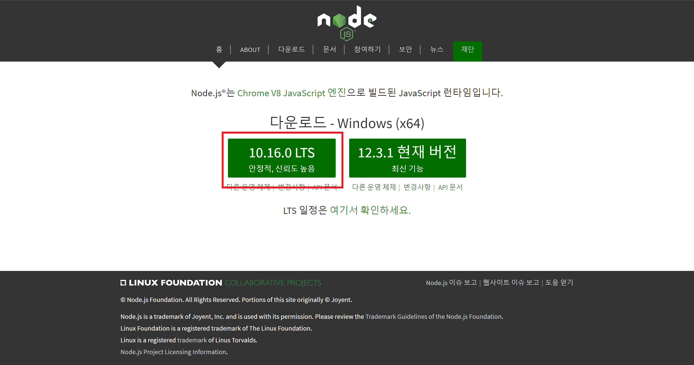
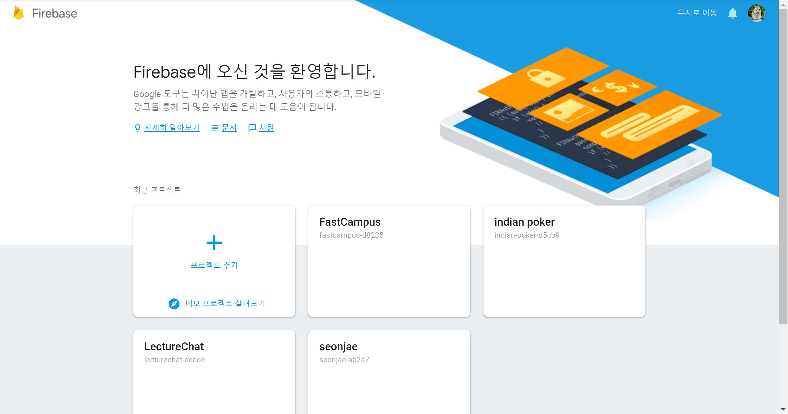
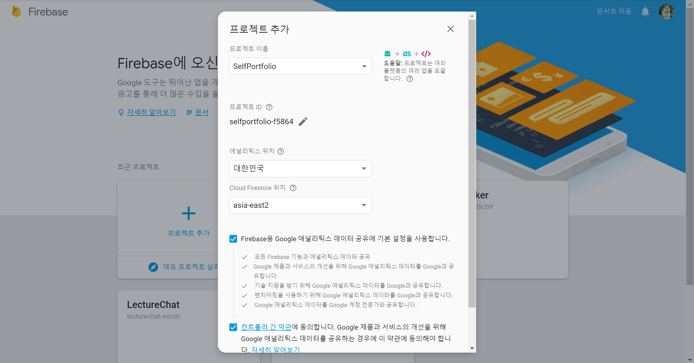
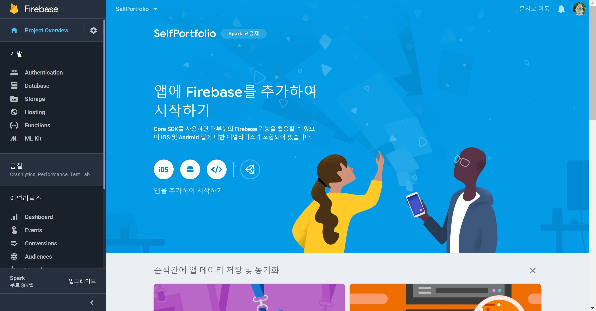

# 프로그래밍 첫 걸음 : 맛 보기
## 준비물
### 1. Microsoft Visual Studio Code
HTML 코드를 편집하기 위한 툴입니다.  
설치하기 : [설치 링크](https://code.visualstudio.com/)  
  
  
  
### 2. NodeJS
배포를 위한 파이어베이스 패키지를 설치하기 위해 필요합니다.  
설치하기 : [설치 링크](https://nodejs.org/ko/)  
  
  
  
### 3. Firebase 프로젝트 생성
파이어베이스의 호스팅 기능으로 배포를 합니다.  
실습에 오기 전에 Firebase Console에서 새 프로젝트를 추가해야 합니다.  
  
콘솔로 [이동 하기](https://console.firebase.google.com/)  
  
  
  
프로젝트 추가 버튼을 누릅니다.  
프로젝트 이름을 입력하고 프로젝트를 만듭니다.  
  
  
  
아래 화면이 나타나면 성공했습니다!  
  
  
  
### 4. 자기소개 페이지에 들어갈 내용 준비하기
[샘플 페이지](https://fastcampus-d8235.firebaseapp.com/)를 참고하여 들어갈 내용들을 가져와 주세요!  
  
1. 사진 파일
2. 사진 밑에 들어갈 정보들 (직업, 사는 곳, 이메일 등)
3. Skills
4. Language
5. Experience
6. Education
7. Introduction